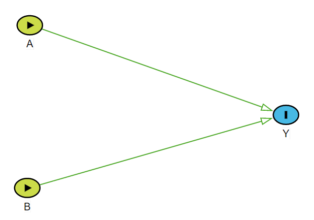

```{r setup, include=FALSE}
knitr::opts_chunk$set(echo = TRUE)
require(SASxport)
require(DiagrammeR)
require(DiagrammeRsvg)
require(rsvg)
library(magrittr)
library(svglite)
library(png)
require(nhanesA)
require(survey)
require(Publish)
require(knitr)
require(jtools)
require(interactions)
require(interactionR)
cache.ON = TRUE
```


# Example data

```{r}
require(interactionR)
data(OCdata)
dim(OCdata)
tail(OCdata)
```

# DAG

```{r dag, echo=FALSE, fig.cap="An illustration of possible interaction by  while investigating the impact of two dichotomous factors: $A$ and $B$ on the dichotomous outcome $Y$.\\label{fig:dag}", out.width = '100%'}

```


# Modelling interaction (OR)

Pr[Y=1] = $\alpha_0$ + $\alpha_A$ A + $\alpha_B$ B + $\alpha_{AB}$ (A $\times$ B)

## Base: no alcohol, no smoking for OR(smk1 on outcome [alc1==0] and OR(alc1 on outcome [smk1==0]

```{r}
Obs.Data <- OCdata
Obs.Data$smk <- as.factor(Obs.Data$smk)
Obs.Data$smk <- relevel(Obs.Data$smk, ref = "0")
Obs.Data$alc <- as.factor(Obs.Data$alc)
Obs.Data$alc <- relevel(Obs.Data$alc, ref = "0")
fit.w.int11 <- glm(oc ~ alc + smk + alc:smk, family = binomial(link = 'logit'), data = Obs.Data)
require(jtools)
results.int.model11 <- summ(fit.w.int11, model.info = FALSE, model.fit = FALSE, exp = TRUE)
results.int.model11
```

## Estimates of different ORs

### Base 

- $\alpha_0$ = `r round(as.numeric(fit.w.int11$coefficients['(Intercept)']),2)`
- $\exp(\alpha_0)$ = `r round(exp(as.numeric(fit.w.int11$coefficients['(Intercept)'])),2)`

### Alcohol

```{r}
# OR00 = 1
OR10 <- exp(sum(summary(fit.w.int11)$coef[c('alc1'),'Estimate']))
OR10 # OR_A=1
```

- $\alpha_A$ = `r round(as.numeric(fit.w.int11$coefficients['alc1']),2)`
- OR_{A=1} = OR10 = $\exp(\alpha_A)$ = `r round(exp(as.numeric(fit.w.int11$coefficients['alc1'])),2)`

### Smoking

```{r}
OR01 <- exp(sum(summary(fit.w.int11)$coef[c('smk1'),'Estimate']))
OR01 # OR_B=1
```

- $\alpha_B$ = `r round(as.numeric(fit.w.int11$coefficients['smk1']),2)`
- OR_{B=1} = OR01 = $\exp(\alpha_B)$ = `r round(exp(as.numeric(fit.w.int11$coefficients['smk1'])),2)`

### Both alcohol and smoking

```{r}
OR11 <- exp(sum(summary(fit.w.int11)$coef[c('alc1','smk1','alc1:smk1'),'Estimate'])) 
OR11 # # OR_A=1,B=1
```

- $\alpha_{AB}$ = `r round(as.numeric(fit.w.int11$coefficients['alc1:smk1']),2)`
- OR_{A=1,B=1} = OR11 = `r round(exp(sum(summary(fit.w.int11)$coef[c('alc1','smk1','alc1:smk1'),'Estimate'])),2)`

### Joint effect?

Is OR11 $\ne$ OR10 * OR01

```{r}
OR10 * OR01
```

### Multiplicative scale

```{r}
Multiplicative.scale <- exp(sum(summary(fit.w.int11)$coef[c('alc1:smk1'),'Estimate'])) 
Multiplicative.scale
```

- Multiplicative.scale = $\exp(\alpha_{AB})$ = `r round(exp(as.numeric(fit.w.int11$coefficients['alc1:smk1'])),2)`

### Additive scales

```{r}
RERI <- OR11 - OR10 - OR01 + 1
RERI
AP <- RERI / OR11
AP
SI <- (OR11 - 1)/ (OR10 - 1 + OR01 - 1)
SI
```


## Base: alcohol drinker, no smoking for OR(smk1 on outcome [alc1==1]

```{r}
Obs.Data <- OCdata
Obs.Data$smk <- as.factor(Obs.Data$smk)
Obs.Data$smk <- relevel(Obs.Data$smk, ref = "0")
Obs.Data$alc <- as.factor(Obs.Data$alc)
Obs.Data$alc <- relevel(Obs.Data$alc, ref = "1")
fit.w.int01 <- glm(oc ~ alc + smk + alc:smk, family = binomial(link = 'logit'), data = Obs.Data)
results.int.model01 <- summ(fit.w.int01, model.info = FALSE, model.fit = FALSE, exp = TRUE)
results.int.model01
```

## Base: Smoker, no alcohol for OR(alc1 on outcome [smk1==1]

```{r}
Obs.Data <- OCdata
Obs.Data$smk <- as.factor(Obs.Data$smk)
Obs.Data$smk <- relevel(Obs.Data$smk, ref = "1")
Obs.Data$alc <- as.factor(Obs.Data$alc)
Obs.Data$alc <- relevel(Obs.Data$alc, ref = "0")
fit.w.int10 <- glm(oc ~ alc + smk + alc:smk, family = binomial(link = 'logit'), data = Obs.Data)
results.int.model10 <- summ(fit.w.int10, model.info = FALSE, model.fit = FALSE, exp = TRUE)
results.int.model10
```


## Reporting guideline

```{r}
int.object <- interactionR(fit.w.int11, 
                            exposure_names = c("alc1", "smk1"), 
                            ci.type = "mover", ci.level = 0.95, 
                            em=FALSE, recode = FALSE)
kable(int.object$dframe[,1:4], digits = 2)
```


# Modelling interaction (RR)


```{r}
Obs.Data <- OCdata
Obs.Data$smk <- as.factor(Obs.Data$smk)
Obs.Data$smk <- relevel(Obs.Data$smk, ref = "0")
Obs.Data$alc <- as.factor(Obs.Data$alc)
Obs.Data$alc <- relevel(Obs.Data$alc, ref = "0")
fit.rr.int11 <- glm(oc ~ alc + smk + alc:smk, family = poisson(link = 'log'), data = Obs.Data)
results.rr.model11 <- summ(fit.rr.int11, model.info = FALSE, model.fit = FALSE, exp = TRUE)
results.rr.model11
```

```{r}
int.object <- interactionR(fit.rr.int11, 
                            exposure_names = c("alc1", "smk1"), 
                            ci.type = "mover", ci.level = 0.95, 
                            em=FALSE, recode = FALSE)
kable(int.object$dframe[,1:4], digits = 2)
```


## Estimates of different RRs

### Alcohol

```{r}
# OR00 = 1
OR10 <- exp(sum(summary(fit.rr.int11)$coef[c('alc1'),'Estimate']))
OR10 # OR_A=1
```

- $\alpha_A$ = `r round(as.numeric(fit.rr.int11$coefficients['alc1']),2)`
- OR_{A=1} = OR10 = $\exp(\alpha_A)$ = `r round(exp(as.numeric(fit.rr.int11$coefficients['alc1'])),2)`

### Smoking

```{r}
OR01 <- exp(sum(summary(fit.rr.int11)$coef[c('smk1'),'Estimate']))
OR01 # OR_B=1
```

- $\alpha_B$ = `r round(as.numeric(fit.rr.int11$coefficients['smk1']),2)`
- OR_{B=1} = OR01 = $\exp(\alpha_B)$ = `r round(exp(as.numeric(fit.rr.int11$coefficients['smk1'])),2)`

### Both alcohol and smoking

```{r}
OR11 <- exp(sum(summary(fit.rr.int11)$coef[c('alc1','smk1','alc1:smk1'),'Estimate'])) 
OR11 # # OR_A=1,B=1
```

- $\alpha_{AB}$ = `r round(as.numeric(fit.rr.int11$coefficients['alc1:smk1']),2)`
- OR_{A=1,B=1} = OR11 = `r round(exp(sum(summary(fit.rr.int11)$coef[c('alc1','smk1','alc1:smk1'),'Estimate'])),2)`

### Joint effect?

Is OR11 $\ne$ OR10 * OR01

```{r}
OR10 * OR01
```

### Multiplicative scale

```{r}
Multiplicative.scale <- exp(sum(summary(fit.rr.int11)$coef[c('alc1:smk1'),'Estimate'])) 
Multiplicative.scale
```

- Multiplicative.scale = $\exp(\alpha_{AB})$ = `r round(exp(as.numeric(fit.rr.int11$coefficients['alc1:smk1'])),2)`

### Additive scales

```{r}
RERI <- OR11 - OR10 - OR01 + 1
RERI
AP <- RERI / OR11
AP
SI <- (OR11 - 1)/ (OR10 - 1 + OR01 - 1)
SI
```


# Interaction definitions

| Groups and Conditions 	| Risk 	| Risk Difference 	| Risk Ratio | Odds Ratio |
|---	|---	|---	|---	| ---	|
| Baseline (exposed to none) 	| $R_{A = 0, B = 0} =  P[Y^{a=0, b=0} | L]$ 	| Reference	|  Reference	| Reference | 
| Exposed to $A$ only 	| $R_{A = 1, B = 0} =  P[Y^{a=1, b=0} | L]$ 	| $RD_{A = 1} = R_{A = 1, B = 0} - R_{A = 0, B = 0}$	| $RR_{A = 1} = R_{A = 1, B = 0} / R_{A = 0, B = 0}$	| $OR_{A = 1} = [R_{A = 1, B = 0} / (1-R_{A = 1, B = 0})] / [R_{A = 0, B = 0} / (1 - R_{A = 0, B = 0})]$ |
| Exposed to $B$ only 	| $R_{A = 0, B = 1} =  P[Y^{a=0, b=1} | L]$ 	| $RD_{B = 1} = R_{A = 0, B = 1} - R_{A = 0, B = 0}$	| $RR_{B = 1} = R_{A = 0, B = 1} / R_{A = 0, B = 0}$	| $OR_{B = 1} = [R_{A = 0, B = 1} / (1-R_{A = 0, B = 1})] / [R_{A = 0, B = 0} / (1 - R_{A = 0, B = 0})]$ |
| Exposed to both $A$ and $B$ 	| $R_{A = 1, B = 1} =  P[Y^{a=1, b=1} | L]$ 	| $RD_{A = 1, B = 1} = R_{A = 1, B = 1} - R_{A = 0, B = 0}$	| $RR_{A = 1, B = 1} = R_{A = 1, B = 1} / R_{A = 0, B = 0}$	| $OR_{A = 1, B = 1} = [R_{A = 1, B = 1} / (1-R_{A = 1, B = 1})] / [R_{A = 0, B = 0} / (1 - R_{A = 0, B = 0})]$ |
| **Condition for interaction** 	 	||  $RD_{A = 1, B = 1} \ne RD_{A = 1} + RD_{B = 1}$	| $RR_{A = 1, B = 1} \ne RR_{A = 1} \times RR_{B = 1}$ 	| $OR_{A = 1, B = 1} \ne OR_{A = 1} \times OR_{B = 1}$	|
| **Synergism** 	 	||  $RD_{A = 1, B = 1} > RD_{A = 1} + RD_{B = 1}$	| $RR_{A = 1, B = 1} > RR_{A = 1} \times RR_{B = 1}$ 	| $OR_{A = 1, B = 1} > OR_{A = 1} \times OR_{B = 1}$	|
| **Antagonism** 	 	||  $RD_{A = 1, B = 1} < RD_{A = 1} + RD_{B = 1}$	| $RR_{A = 1, B = 1} < RR_{A = 1} \times RR_{B = 1}$ 	| $OR_{A = 1, B = 1} < OR_{A = 1} \times OR_{B = 1}$	|
Table: \label{tab:def} Summary of interaction definition by different effect measures.