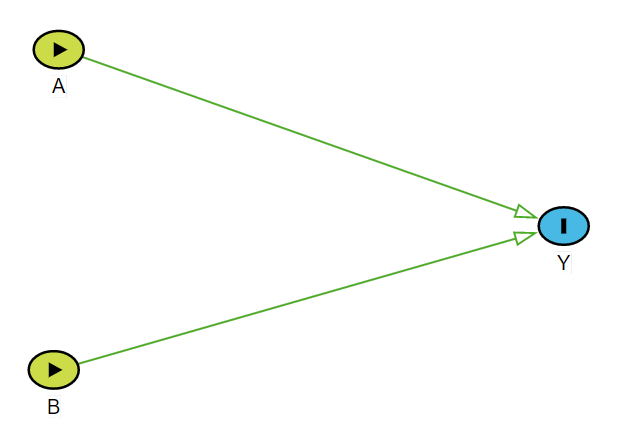

# DAG

<div class="figure">

<p class="caption">An illustration of possible interaction by  while investigating the impact of two dichotomous factors: $A$ and $B$ on the dichotomous outcome $Y$.\label{fig:dag}</p>
</div>

# Interaction definitions

| Groups and Conditions 	| Risk 	| Risk Difference 	| Risk Ratio | Odds Ratio |
|---	|---	|---	|---	| ---	|
| Baseline (exposed to none) 	| $R_{A = 0, B = 0} =  P[Y^{a=0, b=0} | L]$ 	| Reference	|  Reference	| Reference | 
| Exposed to $A$ only 	| $R_{A = 1, B = 0} =  P[Y^{a=1, b=0} | L]$ 	| $RD_{A = 1} = R_{A = 1, B = 0} - R_{A = 0, B = 0}$	| $RR_{A = 1} = R_{A = 1, B = 0} / R_{A = 0, B = 0}$	| $OR_{A = 1} = [R_{A = 1, B = 0} / (1-R_{A = 1, B = 0})] / [R_{A = 0, B = 0} / (1 - R_{A = 0, B = 0})]$ |
| Exposed to $B$ only 	| $R_{A = 0, B = 1} =  P[Y^{a=0, b=1} | L]$ 	| $RD_{B = 1} = R_{A = 0, B = 1} - R_{A = 0, B = 0}$	| $RR_{B = 1} = R_{A = 0, B = 1} / R_{A = 0, B = 0}$	| $OR_{B = 1} = [R_{A = 0, B = 1} / (1-R_{A = 0, B = 1})] / [R_{A = 0, B = 0} / (1 - R_{A = 0, B = 0})]$ |
| Exposed to both $A$ and $B$ 	| $R_{A = 1, B = 1} =  P[Y^{a=1, b=1} | L]$ 	| $RD_{A = 1, B = 1} = R_{A = 1, B = 1} - R_{A = 0, B = 0}$	| $RR_{A = 1, B = 1} = R_{A = 1, B = 1} / R_{A = 0, B = 0}$	| $OR_{A = 1, B = 1} = [R_{A = 1, B = 1} / (1-R_{A = 1, B = 1})] / [R_{A = 0, B = 0} / (1 - R_{A = 0, B = 0})]$ |
| **Condition for interaction** 	 	||  $RD_{A = 1, B = 1} \ne RD_{A = 1} + RD_{B = 1}$	| $RR_{A = 1, B = 1} \ne RR_{A = 1} \times RR_{B = 1}$ 	| $OR_{A = 1, B = 1} \ne OR_{A = 1} \times OR_{B = 1}$	|
| **Synergism** 	 	||  $RD_{A = 1, B = 1} > RD_{A = 1} + RD_{B = 1}$	| $RR_{A = 1, B = 1} > RR_{A = 1} \times RR_{B = 1}$ 	| $OR_{A = 1, B = 1} > OR_{A = 1} \times OR_{B = 1}$	|
| **Antagonism** 	 	||  $RD_{A = 1, B = 1} < RD_{A = 1} + RD_{B = 1}$	| $RR_{A = 1, B = 1} < RR_{A = 1} \times RR_{B = 1}$ 	| $OR_{A = 1, B = 1} < OR_{A = 1} \times OR_{B = 1}$	|
Table: \label{tab:def} Summary of interaction definition by different effect measures.

# Example data


```r
require(interactionR)
data(OCdata)
dim(OCdata)
```

```
## [1] 458   3
```

```r
tail(OCdata)
```

```
##     oc alc smk
## 453  0   0   0
## 454  0   0   0
## 455  0   0   0
## 456  0   0   0
## 457  0   0   0
## 458  0   0   0
```

## Base: no alcohol, no smoking for OR(smk1 on outcome [alc1==0] and OR(alc1 on outcome [smk1==0]


```r
Obs.Data <- OCdata
Obs.Data$smk <- as.factor(Obs.Data$smk)
Obs.Data$smk <- relevel(Obs.Data$smk, ref = "0")
Obs.Data$alc <- as.factor(Obs.Data$alc)
Obs.Data$alc <- relevel(Obs.Data$alc, ref = "0")
fit.w.int11 <- glm(oc ~ alc + smk + alc:smk, family = binomial(link = 'logit'), data = Obs.Data)
require(jtools)
results.int.model11 <- summ(fit.w.int11, model.info = FALSE, model.fit = FALSE, exp = TRUE)
results.int.model11
```

```
## Warning in !is.null(rmarkdown::metadata$output) && rmarkdown::metadata$output
## %in% : 'length(x) = 4 > 1' in coercion to 'logical(1)'
```

  <table class="table table-striped table-hover table-condensed table-responsive" style="width: auto !important; margin-left: auto; margin-right: auto;border-bottom: 0;">
 <thead>
  <tr>
   <th style="text-align:left;">   </th>
   <th style="text-align:right;"> exp(Est.) </th>
   <th style="text-align:right;"> 2.5% </th>
   <th style="text-align:right;"> 97.5% </th>
   <th style="text-align:right;"> z val. </th>
   <th style="text-align:right;"> p </th>
  </tr>
 </thead>
<tbody>
  <tr>
   <td style="text-align:left;font-weight: bold;"> (Intercept) </td>
   <td style="text-align:right;"> 0.15 </td>
   <td style="text-align:right;"> 0.04 </td>
   <td style="text-align:right;"> 0.50 </td>
   <td style="text-align:right;"> -3.06 </td>
   <td style="text-align:right;"> 0.00 </td>
  </tr>
  <tr>
   <td style="text-align:left;font-weight: bold;"> alc1 </td>
   <td style="text-align:right;"> 3.33 </td>
   <td style="text-align:right;"> 0.70 </td>
   <td style="text-align:right;"> 15.86 </td>
   <td style="text-align:right;"> 1.51 </td>
   <td style="text-align:right;"> 0.13 </td>
  </tr>
  <tr>
   <td style="text-align:left;font-weight: bold;"> smk1 </td>
   <td style="text-align:right;"> 2.96 </td>
   <td style="text-align:right;"> 0.68 </td>
   <td style="text-align:right;"> 12.91 </td>
   <td style="text-align:right;"> 1.45 </td>
   <td style="text-align:right;"> 0.15 </td>
  </tr>
  <tr>
   <td style="text-align:left;font-weight: bold;"> alc1:smk1 </td>
   <td style="text-align:right;"> 0.91 </td>
   <td style="text-align:right;"> 0.15 </td>
   <td style="text-align:right;"> 5.42 </td>
   <td style="text-align:right;"> -0.10 </td>
   <td style="text-align:right;"> 0.92 </td>
  </tr>
</tbody>
<tfoot><tr><td style="padding: 0; " colspan="100%">
<sup></sup> Standard errors: MLE</td></tr></tfoot>
</table>

## Base: alcohol drinker, no smoking for OR(smk1 on outcome [alc1==1]


```r
Obs.Data <- OCdata
Obs.Data$smk <- as.factor(Obs.Data$smk)
Obs.Data$smk <- relevel(Obs.Data$smk, ref = "0")
Obs.Data$alc <- as.factor(Obs.Data$alc)
Obs.Data$alc <- relevel(Obs.Data$alc, ref = "1")
fit.w.int01 <- glm(oc ~ alc + smk + alc:smk, family = binomial(link = 'logit'), data = Obs.Data)
results.int.model01 <- summ(fit.w.int01, model.info = FALSE, model.fit = FALSE, exp = TRUE)
results.int.model01
```

  <table class="table table-striped table-hover table-condensed table-responsive" style="width: auto !important; margin-left: auto; margin-right: auto;border-bottom: 0;">
 <thead>
  <tr>
   <th style="text-align:left;">   </th>
   <th style="text-align:right;"> exp(Est.) </th>
   <th style="text-align:right;"> 2.5% </th>
   <th style="text-align:right;"> 97.5% </th>
   <th style="text-align:right;"> z val. </th>
   <th style="text-align:right;"> p </th>
  </tr>
 </thead>
<tbody>
  <tr>
   <td style="text-align:left;font-weight: bold;"> (Intercept) </td>
   <td style="text-align:right;"> 0.50 </td>
   <td style="text-align:right;"> 0.19 </td>
   <td style="text-align:right;"> 1.33 </td>
   <td style="text-align:right;"> -1.39 </td>
   <td style="text-align:right;"> 0.17 </td>
  </tr>
  <tr>
   <td style="text-align:left;font-weight: bold;"> alc0 </td>
   <td style="text-align:right;"> 0.30 </td>
   <td style="text-align:right;"> 0.06 </td>
   <td style="text-align:right;"> 1.43 </td>
   <td style="text-align:right;"> -1.51 </td>
   <td style="text-align:right;"> 0.13 </td>
  </tr>
  <tr>
   <td style="text-align:left;font-weight: bold;"> smk1 </td>
   <td style="text-align:right;"> 2.71 </td>
   <td style="text-align:right;"> 1.00 </td>
   <td style="text-align:right;"> 7.37 </td>
   <td style="text-align:right;"> 1.95 </td>
   <td style="text-align:right;"> 0.05 </td>
  </tr>
  <tr>
   <td style="text-align:left;font-weight: bold;"> alc0:smk1 </td>
   <td style="text-align:right;"> 1.09 </td>
   <td style="text-align:right;"> 0.18 </td>
   <td style="text-align:right;"> 6.48 </td>
   <td style="text-align:right;"> 0.10 </td>
   <td style="text-align:right;"> 0.92 </td>
  </tr>
</tbody>
<tfoot><tr><td style="padding: 0; " colspan="100%">
<sup></sup> Standard errors: MLE</td></tr></tfoot>
</table>

## Base: Smoker, no alcohol for OR(alc1 on outcome [smk1==1]


```r
Obs.Data <- OCdata
Obs.Data$smk <- as.factor(Obs.Data$smk)
Obs.Data$smk <- relevel(Obs.Data$smk, ref = "1")
Obs.Data$alc <- as.factor(Obs.Data$alc)
Obs.Data$alc <- relevel(Obs.Data$alc, ref = "0")
fit.w.int10 <- glm(oc ~ alc + smk + alc:smk, family = binomial(link = 'logit'), data = Obs.Data)
results.int.model10 <- summ(fit.w.int10, model.info = FALSE, model.fit = FALSE, exp = TRUE)
results.int.model10
```

  <table class="table table-striped table-hover table-condensed table-responsive" style="width: auto !important; margin-left: auto; margin-right: auto;border-bottom: 0;">
 <thead>
  <tr>
   <th style="text-align:left;">   </th>
   <th style="text-align:right;"> exp(Est.) </th>
   <th style="text-align:right;"> 2.5% </th>
   <th style="text-align:right;"> 97.5% </th>
   <th style="text-align:right;"> z val. </th>
   <th style="text-align:right;"> p </th>
  </tr>
 </thead>
<tbody>
  <tr>
   <td style="text-align:left;font-weight: bold;"> (Intercept) </td>
   <td style="text-align:right;"> 0.44 </td>
   <td style="text-align:right;"> 0.19 </td>
   <td style="text-align:right;"> 1.02 </td>
   <td style="text-align:right;"> -1.91 </td>
   <td style="text-align:right;"> 0.06 </td>
  </tr>
  <tr>
   <td style="text-align:left;font-weight: bold;"> alc1 </td>
   <td style="text-align:right;"> 3.05 </td>
   <td style="text-align:right;"> 1.29 </td>
   <td style="text-align:right;"> 7.18 </td>
   <td style="text-align:right;"> 2.55 </td>
   <td style="text-align:right;"> 0.01 </td>
  </tr>
  <tr>
   <td style="text-align:left;font-weight: bold;"> smk0 </td>
   <td style="text-align:right;"> 0.34 </td>
   <td style="text-align:right;"> 0.08 </td>
   <td style="text-align:right;"> 1.47 </td>
   <td style="text-align:right;"> -1.45 </td>
   <td style="text-align:right;"> 0.15 </td>
  </tr>
  <tr>
   <td style="text-align:left;font-weight: bold;"> alc1:smk0 </td>
   <td style="text-align:right;"> 1.09 </td>
   <td style="text-align:right;"> 0.18 </td>
   <td style="text-align:right;"> 6.48 </td>
   <td style="text-align:right;"> 0.10 </td>
   <td style="text-align:right;"> 0.92 </td>
  </tr>
</tbody>
<tfoot><tr><td style="padding: 0; " colspan="100%">
<sup></sup> Standard errors: MLE</td></tr></tfoot>
</table>

## Estimates of different ORs


```r
# OR00 = 1
OR10 <- exp(sum(summary(fit.w.int11)$coef[c('alc1'),'Estimate']))
OR10 # OR_A=1
```

```
## [1] 3.333333
```

```r
OR01 <- exp(sum(summary(fit.w.int11)$coef[c('smk1'),'Estimate']))
OR01 # OR_B=1
```

```
## [1] 2.962963
```

```r
OR11 <- exp(sum(summary(fit.w.int11)$coef[c('alc1','smk1','alc1:smk1'),'Estimate'])) 
OR11 # # OR_A=1,B=1
```

```
## [1] 9.036145
```

```r
OR10 * OR01
```

```
## [1] 9.876543
```

```r
Multiplicative.scale <- exp(sum(summary(fit.w.int11)$coef[c('alc1:smk1'),'Estimate'])) 
Multiplicative.scale
```

```
## [1] 0.9149096
```

```r
RERI <- OR11 - OR10 - OR01 + 1
RERI
```

```
## [1] 3.739848
```

```r
AP <- RERI / OR11
AP
```

```
## [1] 0.4138765
```

```r
SI <- (OR11 - 1)/ (OR10 - 1 + OR01 - 1)
SI
```

```
## [1] 1.870482
```

## Reporting guideline


```r
int.object <- interactionR(fit.w.int11, 
                            exposure_names = c("alc1", "smk1"), 
                            ci.type = "mover", ci.level = 0.95, 
                            em=FALSE, recode = FALSE)
kable(int.object$dframe[,1:4], digits = 2)
```


|Measures                     | Estimates|  CI.ll| CI.ul|
|:----------------------------|---------:|------:|-----:|
|OR00                         |      1.00|     NA|    NA|
|OR01                         |      2.96|   0.68| 12.91|
|OR10                         |      3.33|   0.70| 15.86|
|OR11                         |      9.04|   2.64| 30.91|
|OR(smk1 on outcome [alc1==0] |      2.96|   0.68| 12.91|
|OR(smk1 on outcome [alc1==1] |      2.71|   1.00|  7.37|
|OR(alc1 on outcome [smk1==0] |      3.33|   0.70| 15.86|
|OR(alc1 on outcome [smk1==1] |      3.05|   1.29|  7.18|
|Multiplicative scale         |      0.91|   0.15|  5.42|
|RERI                         |      3.74| -11.43| 21.87|
|AP                           |      0.41|  -0.38|  0.81|
|SI                           |      1.87|   0.65|  5.42|
